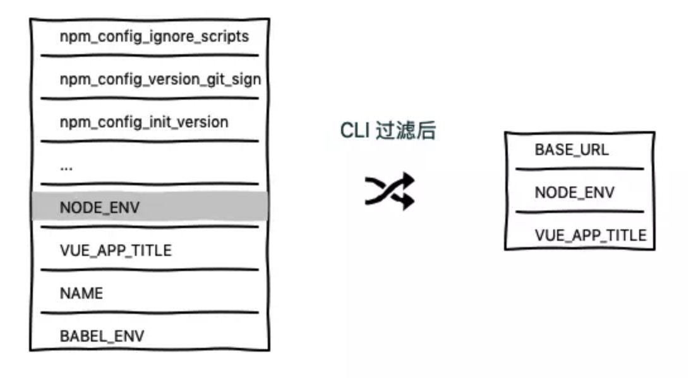

# 使用vue-cli3

2019/09/28 12:33

<!-- TOC -->

- [常用命令](#常用命令)
- [修改webpack配置](#修改webpack配置)
  - [chainWebpack选项](#chainwebpack选项)
  - [configureWebpack选项](#configurewebpack选项)
- [生产环境sourceMap功能](#生产环境sourcemap功能)
- [为本项目增加二级目录](#为本项目增加二级目录)
- [区分本地、开发、生产环境](#区分本地开发生产环境)
  - [通过在不同的环境下注入不同标识区分环境](#通过在不同的环境下注入不同标识区分环境)
  - [如何在客户端侧区分环境](#如何在客户端侧区分环境)

<!-- /TOC -->

## 常用命令

```js
// 检查webpack配置
vue inspect

```

## 修改webpack配置

### chainWebpack选项

chainWebpack 配置项允许我们更细粒度的控制 webpack 的内部配置，其集成的是 webpack-chain 这一插件，该插件可以让我们能够使用链式操作来修改配置

### configureWebpack选项

configureWebpack 更倾向于整体替换和修改，该选项可以是一个对象或者函数。

当为对象时，实际上使用 `webpack-merge` 插件与原有配置进行合并。

当为函数时，可以直接使用其 config 参数来修改 webpack 中的配置。此时该函数也可以返回一个对象，与原有配置进行合并操作。

## 生产环境sourceMap功能

`productionSourceMap` 控制生产环境是否开启 `sourceMap` 功能。开启后，在生产环境中，代码报错时，易于调试，同时会暴露应用源代码

## 为本项目增加二级目录

如果你想要将项目地址加一个二级目录，比如：`http://localhost:8080/vue/`，那么我们需要在 `vue.config.js` 里配置 `baseurl` 这一项。

其改变的其实是 webpack 配置文件中 output 的 publicPath 项，这时候你重启终端再次打开页面的时候我们首页的 url 就会变成带二级目录的形式。

## 区分本地、开发、生产环境

摘自：[掘金小册-vue项目搭建与开发入门](https://juejin.im/book/5b23a5aef265da59716fda09/section/5b291904f265da597f1c74ea)

### 通过在不同的环境下注入不同标识区分环境

我们可以在根目录下创建以下形式的文件进行不同环境下变量的配置：

```js
.env                # 在所有的环境中被载入
.env.local          # 在所有的环境中被载入，但会被 git 忽略
.env.[mode]         # 只在指定的模式中被载入
.env.[mode].local   # 只在指定的模式中被载入，但会被 git 忽略
```

比如我们创建一个名为 .env.stage 的文件，该文件表明其只在 stage 环境下被加载，在这个文件中，我们可以配置如下键值对的变量：

```js
NODE_ENV=stage
VUE_APP_TITLE=stage mode
```

这时候我们怎么在 vue.config.js 中访问这些变量呢？很简单，使用 process.env.[name] 进行访问就可以了，比如：

```js
// vue.config.js

console.log(process.env.NODE_ENV); // development（在终端输出）
```

当你运行 yarn serve 命令后会发现输出的是 development，因为 vue-cli-service serve 命令默认设置的环境是 development，你需要修改 package.json 中的 serve 脚本的命令为：

```js
"scripts": {
    "serve": "vue-cli-service serve --mode stage",
}
```

`--mode stage` 其实就是修改了 webpack 4 中的 mode 配置项为 stage，同时其会读取对应 `.env.[model]` 文件下的配置，如果没找到对应配置文件，其会使用默认环境 development，同样 vue-cli-service build 会使用默认环境 production。

这时候如果你再创建一个 .env 的文件，再次配置重复的变量，但是值不同，如：

```js
NODE_ENV=staging
VUE_APP_TITLE=staging mode
VUE_APP_NAME=project
```

因为 .env 文件会被所有环境加载，即公共配置，那么最终我们运行 vue-cli-service serve 打印出来的是哪个呢？答案是 stage，但是如果是 .env.stage.local 文件中配置成上方这样，答案便是 staging，所以 .env.[mode].local 会覆盖 .env.[mode] 下的相同配置。同理 .env.local 会覆盖 .env 下的相同配置。

由此可以得出结论，相同配置项的权重：

```js
.env.[mode].local > .env.[mode] > .env.local > .env
```

但是需要注意的是，除了相同配置项权重大的覆盖小的，不同配置项它们会进行合并操作，类似于 Javascript 中的 Object.assign 的用法。

### 如何在客户端侧区分环境

通过上述配置文件的创建，我们成功使用命令行的形式对项目环境进行了设置并可以自由切换，但是需要注意的是我们在 Vue 的前端代码中打印出的 process.env 与 vue.config.js 中输出的可能是不一样的，这需要普及一个知识点：webpack 通过 DefinePlugin 内置插件将 process.env 注入到客户端代码中。

```js
// webpack 配置
{
    ...

    plugins: [
        new webpack.DefinePlugin({
            'process.env': {
                NODE_ENV: JSON.stringify(process.env.NODE_ENV)
            }
        }),
    ],

    ...
}
```

由于 vue-cli 3.x 封装的 webpack 配置中已经帮我们完成了这个功能，所以我们可以直接在客户端代码中打印出 process.env 的值，该对象可以包含多个键值对，也就是说可以注入多个值，但是经过 CLI 封装后仅支持注入环境配置文件中以 VUE_APP_ 开头的变量，而 NODE_ENV 和 BASE_URL 这两个特殊变量除外。比如我们在权重最高的 .env.stage.local 文件中写入：

```js
NODE_ENV=stage2
VUE_APP_TITLE=stage mode2
NAME=vue
```

然后我们尝试在 vue.config.js 中打印 process.env，终端输出：

```js
{
    ...

    npm_config_ignore_scripts: '',
    npm_config_version_git_sign: '',
    npm_config_ignore_optional: '',
    npm_config_init_version: '1.0.0',
    npm_package_dependencies_vue_router: '^3.0.1',
    npm_config_version_tag_prefix: 'v',
    npm_node_execpath: '/usr/local/bin/node',
    NODE_ENV: 'stage2',
    VUE_APP_TITLE: 'stage mode2',
    NAME: 'vue',
    BABEL_ENV: 'development',

    ...
}
```

可以看到输出内容除了我们环境配置中的变量外还包含了很多 npm 的信息，但是我们在入口文件 main.js **客户端侧代码**中打印会发现输出：

```js
{
    "BASE_URL": "/vue/",
    "NODE_ENV": "stage2",
    "VUE_APP_TITLE": "stage mode2"
}
```

可见注入时过滤调了非 VUE_APP_ 开头的变量，其中多出的 BASE_URL 为你在 vue.config.js 设置的值，默认为 /，其在环境配置文件中设置无效。


