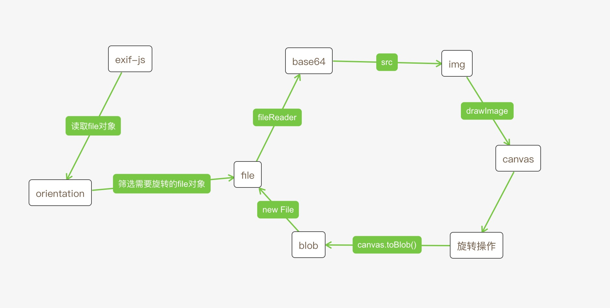

# 图片上传后被旋转问题

2019/09/22 17:22

<!-- TOC -->

- [背景](#背景)
- [产生问题原因](#产生问题原因)
- [EXIF信息](#exif信息)
- [如何解决](#如何解决)
  - [方法一：阿里云官方解决方案](#方法一阿里云官方解决方案)
  - [方法二：修改图像元数据](#方法二修改图像元数据)
    - [代码示例](#代码示例)
- [参考资料](#参考资料)

<!-- /TOC -->

## 背景

开发移动端应用，使用原生 `file` 标签开发上传图片功能时，发现部分安卓手机，上传图片到阿里云成功后，使用返回的url回显插入到dom中时被莫名其妙地逆时针旋转了90度。

## 产生问题原因

一般通过手机或者倒置相机等方式拍出来的照片其实已经旋转，带有旋转参数。但是在图片查看器、浏览器中打开会对旋转参数的图片进行处理，所以我们看到的图片是正的。

## EXIF信息

EXIF是专门为数码相机的照片设定，可以记录数码照片的属性信息和拍摄数据。

手机在拍照生成图片时，也会生成图片EXIF信息，我们称之为元数据。

所谓元数据，是用于描述数据的数据（信息）。

元数据中的 `Orientation` 属性即旋转参数，标识图片被旋转了多少度。

## 如何解决

### 方法一：阿里云官方解决方案

[阿里云官方解决方案](https://help.aliyun.com/document_detail/44691.html?spm=a2c4g.11186623.6.1245.720c3091TC4Rv9)

### 方法二：修改图像元数据

解决思路是在上传阿里云逻辑之前，使用适配器模式，加一层适配逻辑。把被旋转过的file对象，转化成正常的file对象，再继续传阿里云。

1. 使用 `exif-js` 库获取图片元数据中的 `Orientation` 参数
2. 根据参数判断图片是否需要旋转处理

   `Orientation` 值为 `undefined` 或 `0` 或 `1`  时，表示生成图片没有被旋转，因此不需要做额外的旋转处理

3. 拿到 `file` 类型数据，使用 `fileReader` 转换成 `base64`
4. 在内存中创建image元素，读取 `base64` 生成img元素
5. 在 `img` 元素 `onload` 时，使用 `canvas` 绘制图像
6. 根据 `Orientation` 旋转 `canvas` 图层到正确的方向
7. 将 `canvas` 对象转化为 `blob` 对象
8. 将 `blob` 对象转化为 `file` 对象
9. 回到上传阿里云的操作

#### 代码示例

```js
/*
 * @Author: zbw
 * @Date: 2019-09-19 18:50
 */

import EXIF from 'exif-js'

function fileToDataURL (file) {
  return new Promise((resolve, reject) => {
    try {
      const reader = new FileReader()
      reader.onloadend = function (e) {
        resolve(e.target.result)
      }
      reader.readAsDataURL(file)
    } catch (e) {
      reject(e)
    }
  })
}

function canvasResizetoFile (canvas, quality = 1) {
  return new Promise((resolve, reject) => {
    canvas.toBlob(function (blob) {
      resolve(blob)
    }, 'image/jpeg', quality)
  })
}

function blobToFile (theBlob, fileName) {
  return new window.File([theBlob], fileName, {type: theBlob.type})
}

function getOrientation (file) {
  return new Promise((resolve, reject) => {
    try {
      let orientation = 0
      EXIF.getData(file, function () {
        orientation = EXIF.getTag(this, 'Orientation')
        resolve(orientation)
      })
    } catch (e) {
      reject(e)
    }
  })
}

/**
 * 处理图片EXIF元数据
 * @param file
 */
async function handleEXIF (file) {
  return new Promise(async (resolve, reject) => {
    try {
      // 从图片元数据中读取旋转标识
      const orientation = await getOrientation(file)

      // 正常未被旋转的图片orientation值
      const normalType = [0, 1]
      if (!orientation || normalType.includes(Number(orientation))) resolve(file)

      // 如果图片元数据中标识图片已经被旋转过了，则重置图片回未旋转状态，兼容同小米6等机型
      const base64Data = await fileToDataURL(file)
      let imgTem = new Image()
      imgTem.onload = async function () {
        const canvas = document.createElement('canvas')
        const ctx = canvas.getContext('2d')
        const width = imgTem.width
        const height = imgTem.height
        const isReverseSize = [6, 8].includes(Number.parseInt(orientation))
        canvas.width = isReverseSize ? height : width
        canvas.height = isReverseSize ? width : height
        switch (orientation) {
          // 测试代码
          // case 1:
          // case undefined:
          //   ctx.drawImage(imgTem, 0, 0)
          //   break
          case 6:
            // 图片顺时针旋转90°
            ctx.rotate(Math.PI / 2)
            ctx.translate(0, -height)
            ctx.drawImage(imgTem, 0, 0)
            break
          case 3:
            // 图片顺时针旋转180°
            ctx.rotate(Math.PI)
            ctx.translate(-width, -height)
            ctx.drawImage(imgTem, 0, 0)
            break
          case 8:
            // 图片顺时针旋转270°
            ctx.rotate(-Math.PI / 2)
            ctx.translate(-height, 0)
            ctx.drawImage(imgTem, 0, 0)
            break
        }

        const blob = await canvasResizetoFile(canvas)
        const fileObj = blobToFile(blob, file.name)
        resolve(fileObj)
      }
      imgTem.src = base64Data
    } catch (e) {
      reject(e)
    }
  })
}
export {
  handleEXIF
}
```



## 参考资料

- [同一问题](http://www.mamicode.com/info-detail-2440485.html)
- [exif-js](https://github.com/exif-js/exif-js)
- [Exif.js 读取图像的元数据](http://code.ciaoca.com/javascript/exif-js/)
- [一个图片数据类型转换库](https://github.com/WangYuLue/image-conversion)
- [fileReader-mdn](https://developer.mozilla.org/zh-CN/docs/Web/API/FileReader)
- [图片数据类型转换相关1](https://www.cnblogs.com/lwxiao/p/10519617.html)
- [图片数据类型转换相关2](https://www.jianshu.com/p/5b44c41adfe2)
- [如何解决正常原图处理之后为被旋转的问题](https://help.aliyun.com/knowledge_detail/39624.html)
